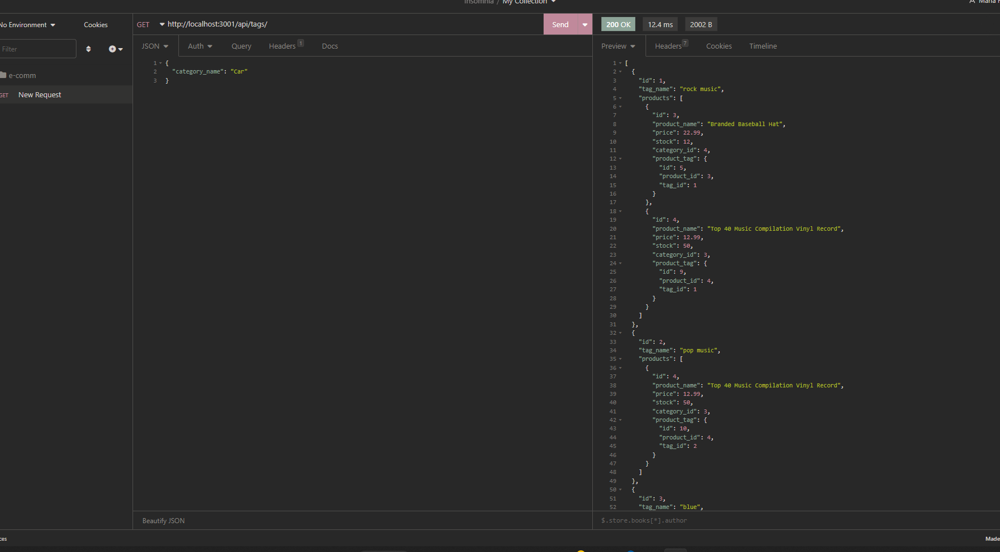
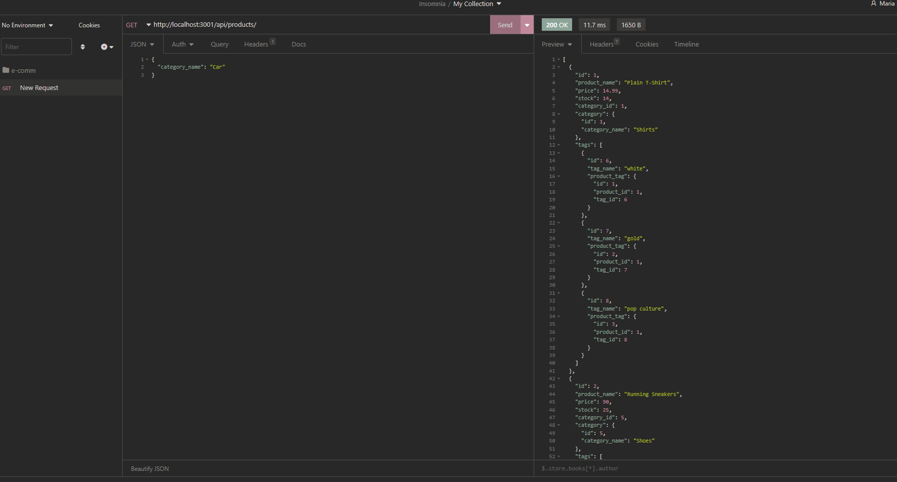
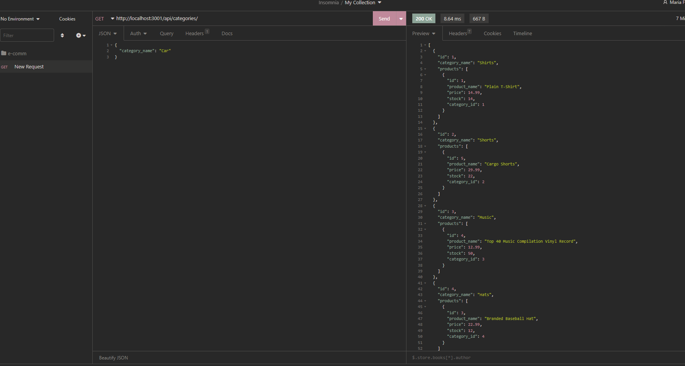
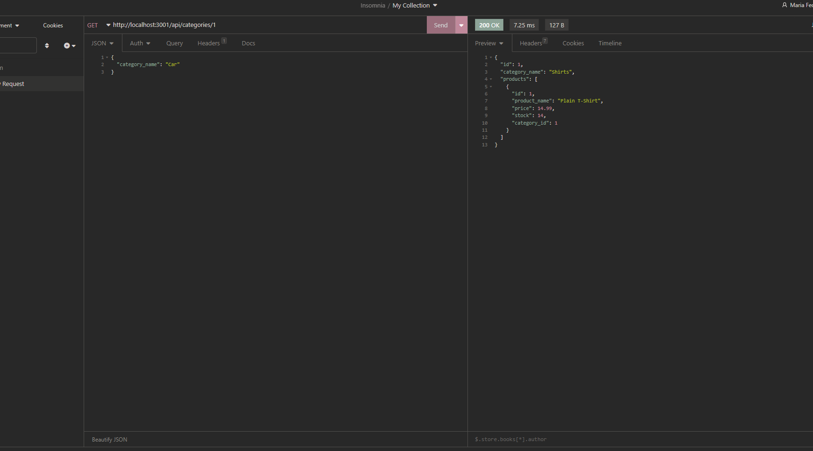
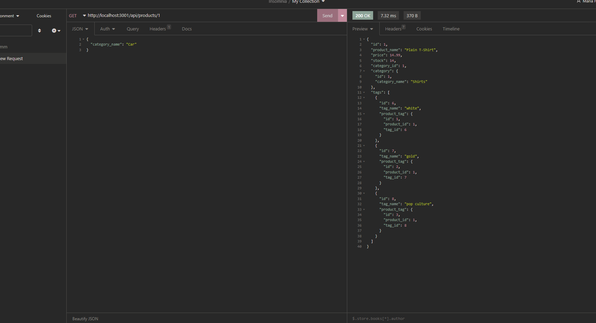
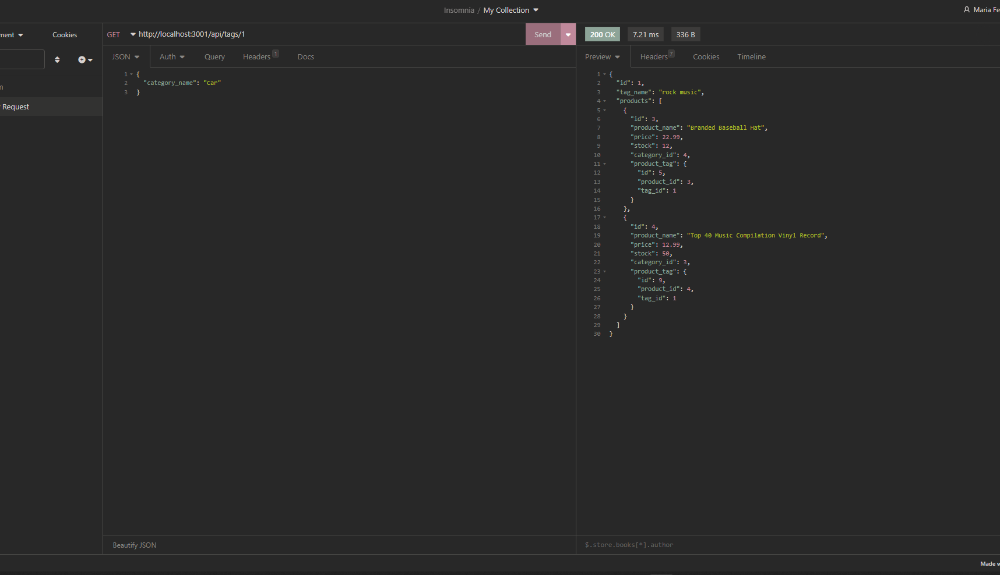
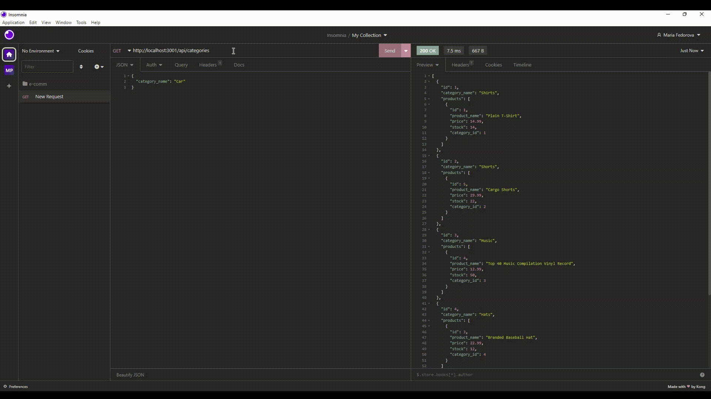
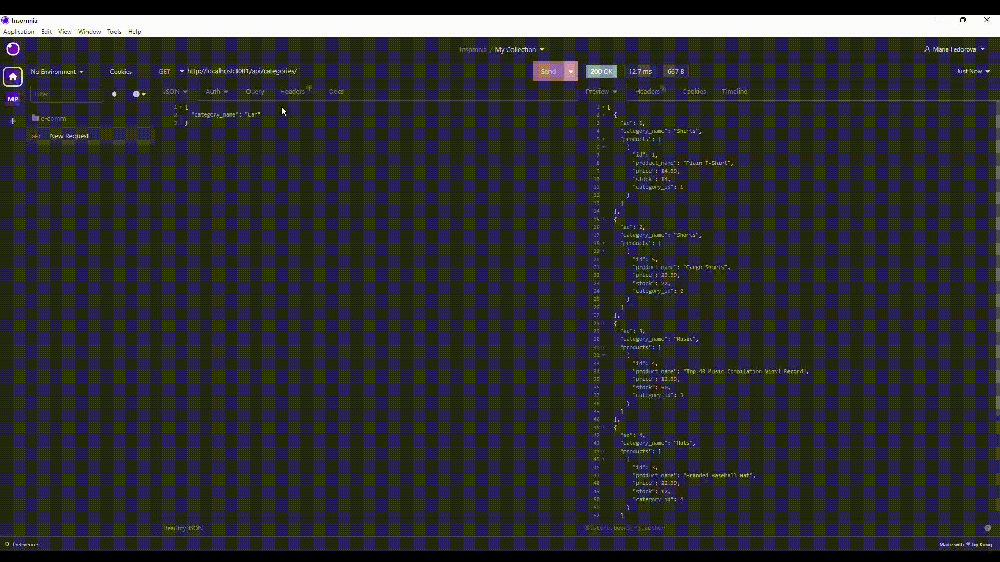

# E-commerce-Back-End
## Description
This app is the backend portion of an E-Commerce website. Express.js was used for the server and MySQL for the database along with Sequelize as the ORM to run SQL models and queries. The SQL database includes tables for products, categories, tags, and product tags. RESTful API routes are used to make requests and updates from the database which are joined through Sequelize queries.

## Installation
Download or clone repository 
-npm install to install the required npm packages 
-npm install mysql2 
-npm i sequelize 
-npm i express
-npm i dotenv 

Open VsCode Terminal 
-open db folder 
-type mysql -u root -p 
-source schema.sql 
-npm run seed 
-npm start 
-App listening on port 3001! 
-open Insomnia to request 

## Usage
To run project on local mashine you also need to change password 
in .env file to your personal (Mysql) password 
## Images of Deployed Application
For all categories,all products,all tags 

For single category, product,tags 

Images for POST PUT DELETE 
## Video showing the functionality of the application

 Video shows  GET routes to return  all categories, all products, and all tags 
 And return single categories, single products,single tags 

Video shows  POST, PUT, and DELETE routes in Insomnia  

## Relevant Links
Link video : 
https://drive.google.com/file/d/1937Qf_WpADf43JFJ-vnlIgDfw9TngJbW/view
 
https://drive.google.com/file/d/1gsTMWNTDpBu2Y-gBcrJpYjclfoh5Go3T/view
Github Repo:  
https://github.com/Mary90272/E-commerce-Back-End
